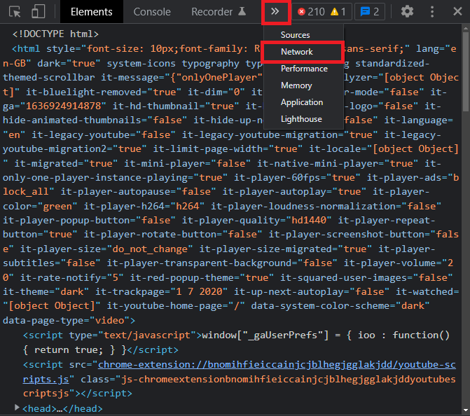
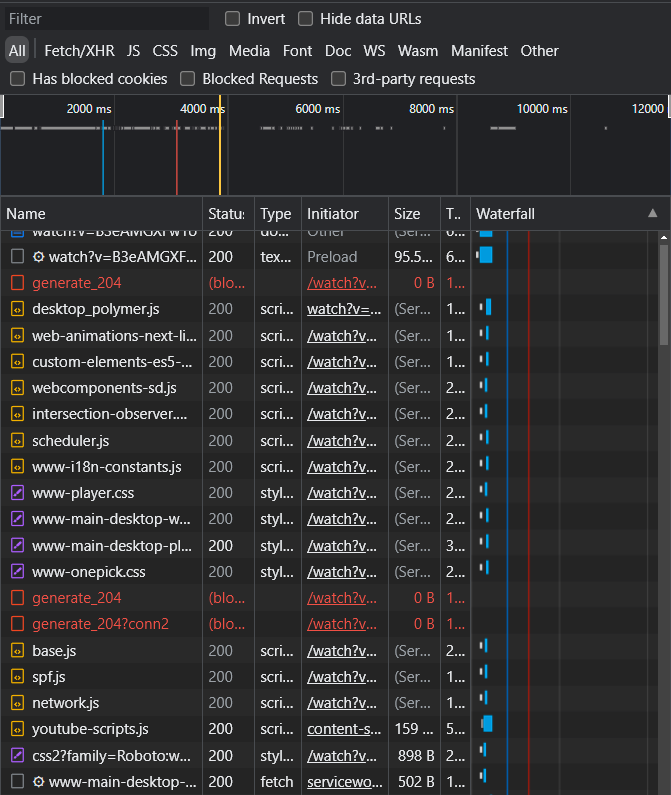
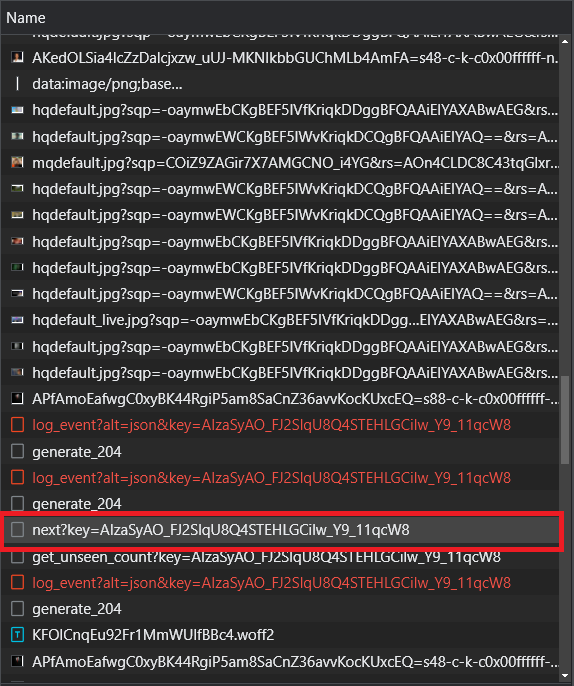
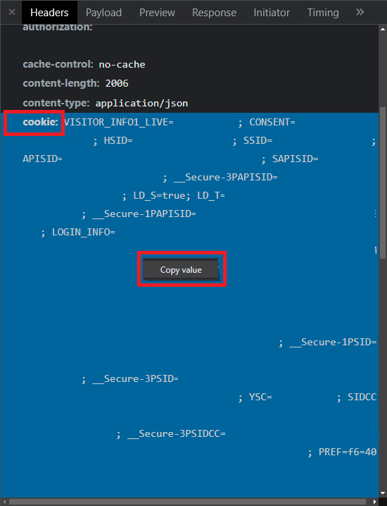
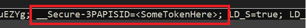
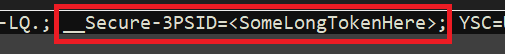

The following steps are tested in Chrome and Microsoft Edge:
1. Navigate to [YouTube](https://youtube.com) and log in to your account.\
   *Note: You need to have your birthday verified for this procedure to work. Consult the [official google documentation](https://support.google.com/youtube/answer/3159776?hl=en-GB) if you have not done this as of yet!*

2. Open the developer console and switch to the network tab by pressing `CTRL + Shift + I`.\

3. Play an age restricted YouTube video (like [this one](https://www.youtube.com/watch?v=B3eAMGXFw1o)) while the network tab is open. You will see the network tab filling with entries.\

4. Scroll down in the list, search for and select one of the following entries:
* *player?*
* *next?*
* *browse?*
* *log_event?*\

5. On the right side, scroll down to **Request Header** and search for **cookie:**. Select a different entry shown in step 4 if **cookie:** is not present. Right click on cookie and copy it and paste it in a text editor of your choice.\
\

6. Search for **__Secure-3PAPISID=** in the text and copy the token to the **PAPISID =** setting in your bots' *config.txt*. Select a different entry from the list shown in step 4 in case the token cannot be found and repeat steps 5 and 6.\

7. Search for **__Secure-3PSID=** in the text and copy the token to the **PSID =** setting in your bots' *config.txt*.\

8. Your bots' config file should have the following two new lines:\
**PAPISID = {YOUR_TOKEN_FROM_STEP_6}**\
**PSID = {YOUR_TOKEN_FROM_STEP_7}**

9. Start/Restart your bot. Enjoy!

